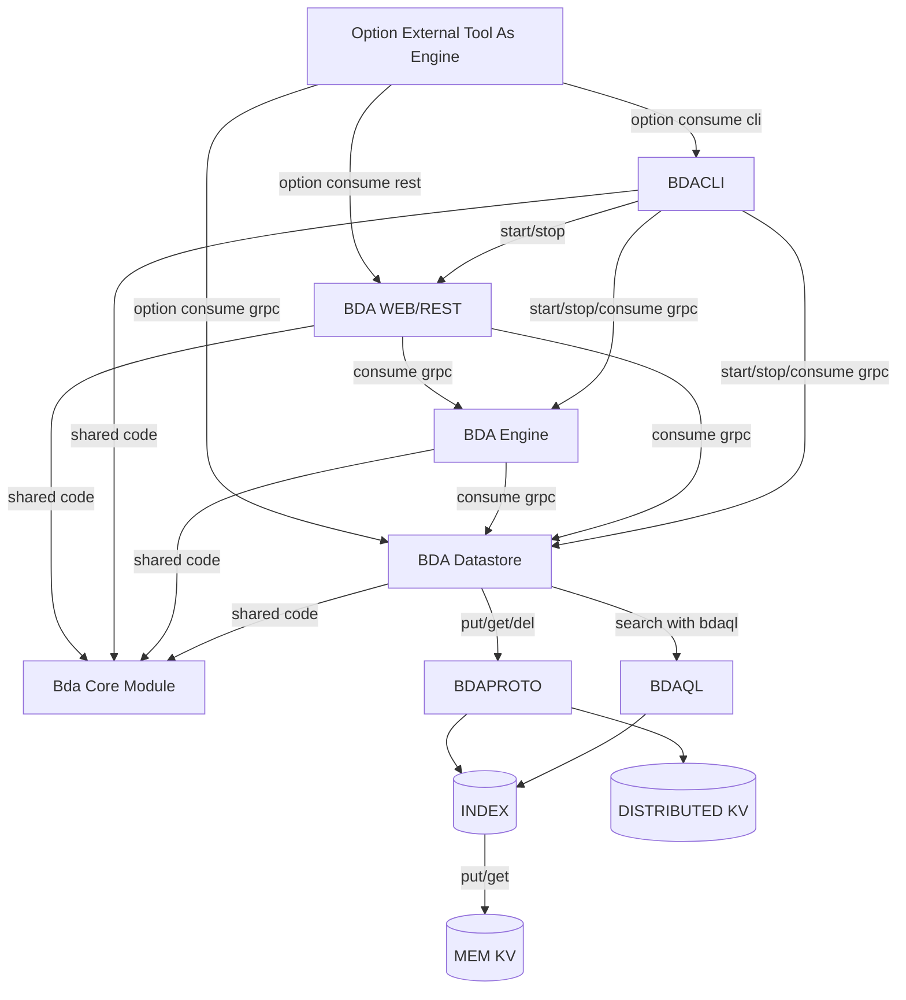

# BDA

Build and Deploy Applications

**STATUS** : Experimental and WIP

Components:

- BDA PROTO: Provides a common domain language to declare software products, dependencies between components, with instructions on how to build, test and deploy
- BDA DATASTORE: Provides a datastore to persist bda proto with versioning support. It should have a cli and webapp admin clients
- BDA ENGINE: Provides a distributed environment to execute bda instructions
- BDA CONFIGURATORS: Configure ci/cd tools to work with bda engine

[](https://mermaid-js.github.io/mermaid-live-editor/edit/#pako:eNqNVN9PqzAU_leaPmmi4X0PJmxtDJENZb1qMnyo9DhIoMVS4r0R__dbOkCmc5OXnh_f-Tjn8JV3nCoBeIa3mlcZYiSRyD5z4i-imG7mgqOF0oCWSjQFPI1ZuroOVjZPfETlNpdDivjMXzNXalOEG14bW99n6SOj8coPWRSFm6gyuZKI_jWgJS8QU6pAfr3PF6wIfdycueO8jy3p8uZ-c2YPdHM_BEmwZnEXdkYw_8MomaRtN3fhaD7QuevPnl5M1-wTtAiDqX15edXWhmvj2TGqdlf6M8BLlaybEtBWV2k77uK3BeNep412BSdoD6G-c-3cU3Sj6xoFrtMMveUmQ8-CvxbtZI_7yIxrEKgTU9uL58CLj6GG3RyB9HMeg9yFFuHUMtFPV1Q1xtuCaZ14DgzQ5z0BbsjbOGLRyOq8feJJtJfed4l3vGqn8mHlGmqzJ6MT-LTI26ksT8C_ftFE4gtcgi55Luwlf-9IEmwyKCHBM2sKeOFNYRKcyA8LbSrBDVCR20uLZy-8qOEC88ao9T-Z4pnRDQwgknP7zyh71Md_WKhS1A)
